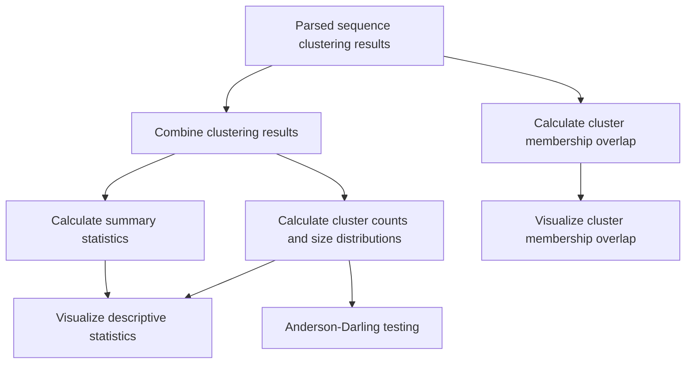

# ClusterGuide

_A Snakemake Pipeline for Benchmarking Sequence Clustering Programs_


Logo created in BioRender. Varga, V. (2026) https://BioRender.com/ghl3gq8

Author: Vi Varga

Last Major Update: 2026.08.17


## Introduction

ClusterGuide is a Python- and R-based toolbox for benchmarking sequence clustering programs.

The workflow consolidates clustering results from multiple programs, calculates descriptive statistics and cluster-size distributions, performs statistical testing of cluster-size differences, and evaluates the degree of overlap in cluster membership between programs.

ClusterGuide is designed to be flexible with respect to the sequence clustering programs being benchmarked. Because there is no standardized output format shared by sequence clustering programs, parsing of program-specific output files remains a user-modified preprocessing step.


## Pipeline structure

The ClusterGuide Snakemake pipeline performs the following steps:

Once the clustering results have been parsed, the ClusterGuide Snakemake pipeline performs the following steps:

1. Parsed clustering results are combined into a single database.
2. Summary statistics are calculated for the clustering results.
3. Cluster counts and cluster-size distributions are calculated.
4. Descriptive statistics are visualized.
5. Differences in cluster-size distributions are tested using the Anderson-Darling test.
6. Cluster membership overlap between programs is calculated.
7. Cluster membership overlap is visualized as a heatmap.

The workflow can be summarized as follows:



The parsing step is intentionally separate from the Snakemake workflow because sequence clustering programs do not use a standardized output format. An example parser supporting CD-HIT, Diamond, MMseqs2 and USEARCH is provided, but users should modify the parser as necessary for their programs of interest.


## Dependencies

The primary dependencies of the ClusterGuide workflow are:

 - Snakemake
 - Apptainer

The programs used by the workflow are installed in an Apptainer container. The container is generated from the `conda` environment specification included in the repository.

A Conda or Mamba installation is also recommended for creating an environment for the initial data pre-processing results parsing step.


## Setting up ClusterGuide

Clone the ClusterGuide repository, then work from the main `ClusterGuide/` directory.

### Input and output structure

A typical ClusterGuide working directory has the following structure:

```
├── LICENSE
├── README.md
├── config
│   └── config.yaml
├── data
│   ├── {PARSED_DATABASE_1}
│   ├── {PARSED_DATABASE_2}
│   ├── {PARSED_DATABASE_3}
│   └── {PARSED_DATABASE_4}
├── img
│   └── Logo__ClusterGuide.png
└── workflow
    ├── containers
    │   └── env-clusterguide.sif
    ├── envs
    │   └── env-clusterguide.yml
    ├── scripts
    └── Snakefile
```

Results generated by the workflow are written to the `results/` directory. Logs generated by Snakemake and the membership-overlap analysis are written to the `logs/` directory.

The exact output paths are controlled by `config/config.yaml`.

Create the directories used for input and output files:

```bash
mkdir data/
mkdir results/
```

### Building the Apptainer container

The ClusterGuide workflow uses an Apptainer container to provide the Python and R dependencies required by the pipeline.

From the main `ClusterGuide/` directory, build the container as follows:

```bash
cd workflow/containers

apptainer build \
    --build-arg ENV_FILE=../envs/env-clusterguide.yml \
    env-clusterguide.sif \
    ../scripts/conda_environment_args_ubuntu.def

cd ../..
```

The resulting container should be located at: `workflow/containers/env-clusterguide.sif`


### Data pre-processing: Parsing existing sequence clustering results

The parsing step is not part of the Snakemake workflow. If you need to parse raw clustering-program output, you can create a Conda environment containing the dependencies required by the example parser:

```bash
conda env create --file workflow/envs/env-clusterguide.yml
conda activate env-clusterguide
```

The example parser currently supports:
 - CD-HIT
 - Diamond
 - MMseqs2
 - USEARCH

The `ortho_results_parser.py` parser should be modified as necessary to accommodate the output format of the clustering programs being benchmarked.

The parsing script is written with `argparse`, and can be used like so: 

```bash
# parsing program results
python ortho_results_parser.py [-h] -i INPUT_FILE [-c] [-d] [-m] [-u] [-o OUT_NAME] [-v]
# where -c, -d, -m & -u specify which sequence clustering program's results should be parsed
# CD-HIT, Diamond, MMseqs2 or USEARCH, respectively
# -o allows the user to specify an output file basename
```

The resulting parsed files should be placed in the `data/` directory. The paths to these files should then be specified in `config/config.yaml`.

### Parser limitations

The parser is intentionally not integrated into the Snakemake workflow.

There is currently no standardized output-file structure for sequence clustering programs. Results may differ with regard to:
 - File format and extension
 - Delimiters
 - Whether clusters are named, numbered, or unnamed
 - Whether proteins or clusters are represented by rows or columns
 - The organization of cluster membership information
 - Program-specific metadata

Consequently, a universal parser is not practical. The included `ortho_results_parser.py` script should therefore be regarded as an example parser rather than a universally applicable component of the workflow.

If the parser does not support the output format of a program you wish to benchmark, modify the parser accordingly. The example parser is included to provide a starting point for this process.


## Configuration

The primary workflow settings are contained in: `config/config.yaml`

This file specifies, among other things:
 - Input parsed clustering databases
 - Output file locations
 - Dataset identifiers
 - Descriptive-statistics settings
 - Cluster membership overlap settings
 - Membership-overlap checkpoint information
 - Names of the clustering programs being compared

The membership-overlap settings include the run mode, checkpoint number and checkpoint JSON file where applicable.

Please see the comments in `config/config.yaml` for details on the available options.


## Running the Snakemake pipeline

Before running the workflow, configure the `config/config.yaml` file with the appropriate input files and analysis settings.

The pipeline should be run from the main `ClusterGuide/` directory.

### Optional: Test the workflow with a dry run

A dry run can be used to check that Snakemake has constructed the expected workflow without executing any jobs:

```bash
snakemake --use-singularity --cores 2 --dry-run
```

### Run the workflow

To run the complete workflow:

```bash
snakemake --use-singularity --cores 2
```

The number of cores can be adjusted as appropriate for the system. As none of the steps are parallelized, it is sufficient to use 1-2 cores.

The --use-singularity flag is required because the programs used by the workflow are provided through the Apptainer/Singularity container.


### Cluster membership overlap testing

The cluster membership overlap analysis has two modes of operation:
 - Complete run: perform the analysis from the beginning using the parsed clustering databases.
 - Checkpoint-based run: resume the analysis from a previously completed checkpoint.

These options are controlled through `config/config.yaml`.

The underlying `og_membership_test.py` script supports checkpoints 2, 3, 4 and 5. This allows a previously completed membership overlap analysis to be resumed without repeating earlier computational steps.

The program names supplied in `config.yaml` should correspond to the clustering databases being compared.


## Publication & Citation

This GitHub repository is associated with an upcoming manuscript. Citation information will be added upon publication.

The scripts contained in the `PublicationSupplement/` directory are the scripts used to process data and generate figures for the associated manuscript.

## License

ClusterGuide is released under the MIT License. See the [LICENSE](./LICENSE) file for details.
